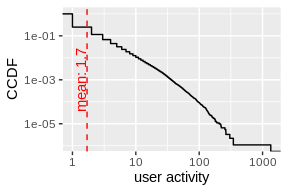
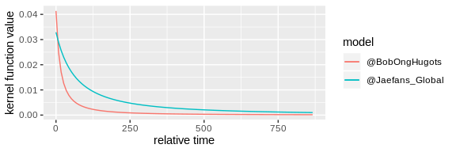

User Analysis on reshare cascades about COVID-19
================

## Dataset

In this tutorial, we apply two tools for analyzing Twitter users,
`birdspotter` and `evently`, on a COVID-19 retweet dataset. The dataset
is curated by Chen, et al. One can obtain a copy of the tweet IDs from
their \[project\]\](<https://github.com/echen102/COVID-19-TweetIDs>). We
only use the 31st of Janury sample of the whole dataset for
demonstration purpose. The tweets can be recovered by `de-hydrating`
from their IDs. We note that some tweets might have been deleted and in
the end we manage to get 69.2% (1,489,877) of the original tweets.

## Tools

While `BirdSpotter` captures the social influence and botness of Twitter
users, `evently` specifically models the temporal dynamics of online
information diffusion. We leverage information provided by the tools to
study the users in the COVID19 dataset.

``` r
library(evently)
library(reticulate)
birdspotter <- import('birdspotter')
```

## Preprocessing tweets

At this step, we seek to extract diffusion cascades from the `COVID-19`
dataset for analyzing user influence and botness. A diffusion cascade
consist of an initial tweet posted by a Twitter user and followed then
by a sereis of retweets. A function provided by `evently` allows one to
obtain cascades from JSON formatted raw tweets. On the other hand, we
initialize a `BirdSpotter` instance and compute the influence and
botness scores for all users in the
dataset.

``` r
cascades <- parse_raw_tweets_to_cascades('corona_2020_01_31.jsonl', keep_user = T, keep_absolute_time = T)
bs <- birdspotter$BirdSpotter('corona_2020_01_31.jsonl')
labeled_users <- bs$getLabeledUsers()[, c('user_id', 'botness', 'influence')]
```

As we cannot publish `corona_2020_01_31.jsonl` due to Twitter TOC, we
have stored the results and load them below

``` r
load('corona_2020_01_31.rda')
labeled_users <- read.csv('corona_31_botness_influence.csv', stringsAsFactors = F,
                          colClasses=c("character",rep("numeric",3)))
```

We note that all user IDs have been encrypted. After obtaining the
results, let’s first conduct some simple measurements on users and
cascades.

``` r
library(ggplot2)
# check the density of these two values
mean_bot <- mean(labeled_users$botness, na.rm = T)
ggplot(labeled_users, aes(botness)) +
  stat_density(geom = 'line') +
  geom_vline(xintercept = mean_bot, linetype=2, color = 'red') +
  geom_text(data=data.frame(), aes(x = mean_bot, y = 2, label= sprintf('mean: %s', round(mean_bot, 2))), color= 'red', angle=90, vjust=-0.11)
```

<!-- -->

``` r
mean_inf <- mean(labeled_users$influence)
ggplot(labeled_users) +
  stat_ecdf(aes(influence, 1 - ..y..)) +
  scale_x_log10() +
  scale_y_log10() +
  ylab('CCDF') +
  geom_vline(xintercept = mean_inf, linetype=2, color = 'red') +geom_text(data=data.frame(), aes(x = mean_inf, y = 1e-3, label= sprintf('mean: %s', round(mean_inf, 2))), color= 'red', angle=90, vjust=-0.11)
```

    ## Warning: Transformation introduced infinite values in continuous y-axis

<!-- -->

``` r
mean_value <- mean(sapply(cascades, nrow))
ggplot(data.frame(size = sapply(cascades, nrow))) +
  stat_ecdf(aes(size, 1 - ..y..)) +
  scale_x_log10() + scale_y_log10() +
  geom_vline(xintercept = mean_value, linetype=2, color = 'red') +
  geom_text(data=data.frame(), aes(x = mean_value, y = 1e-3, label= sprintf('mean: %s', round(mean_value, 2))), color= 'red', angle=90, vjust=-0.11) +
  xlab('cascade size') +
  ylab('CCDF')
```

    ## Warning: Transformation introduced infinite values in continuous y-axis

<!-- -->

``` r
mean_value2 <- mean(sapply(cascades, function(c) c$time[nrow(c)]))
ggplot(data.frame(time = sapply(cascades, function(c) c$time[nrow(c)]))) +
  stat_ecdf(aes(time, 1 - ..y..)) +
  scale_x_continuous(trans = 'log1p', breaks = c(0, 100, 10000, 1000000), labels = c('0', '1e2', '1e4', '1e6')) +
  scale_y_log10() +
  geom_vline(xintercept = mean_value2, linetype=2, color = 'red') +
  geom_text(data=data.frame(), aes(x = mean_value2, y = 1e-3, label= sprintf('mean: %s', round(mean_value2, 2))), color= 'red', angle=90, vjust=-0.11) +
  xlab('cascade final event time')+
  ylab('CCDF')
```

    ## Warning: Transformation introduced infinite values in continuous y-axis

<!-- -->

``` r
mean_value <- mean(labeled_users$activity)
ggplot(data.frame(size = labeled_users$activity)) +
   stat_ecdf(aes(size, 1 - ..y..)) +
   scale_x_log10() +
   scale_y_log10() +
   geom_vline(xintercept = mean_value, linetype=2, color = 'red') +
   geom_text(data=data.frame(), aes(x = mean_value, y = 1e-3, label= sprintf('mean: %s', round(mean_value, 2))), color= 'red', angle=90, vjust=-0.11) + xlab('user activity')+ ylab('CCDF')
```

    ## Warning: Transformation introduced infinite values in continuous y-axis

<!-- -->

## Retrain the bot detector

If one find the botness scores are not accurate, `birdspotter` provides
a relabeling tool and a retrain API to learn from the given relabeled
dataset

``` r
# output a file for mannual labeling
bs$getBotAnnotationTemplate('users_to_label.csv')
# Once annotated the botness detector can be trained with
bs$trainClassifierModel('users_to_label.csv')
```

## Fit user posted cacsades with `evently`

We model a group of cascades initiated by a particular user jointly and
treat the fitted model as a characterization of the user. In this
example, we select two users for comparison.

``` r
selected_users <- c('369686755237813560', '174266868073402929')

# fit Hawkes process on cascades initiated by the selected users
user_cascades_fitted <- lapply(selected_users, function(user) {
  # select cascades that are initiated by the "selected_user"
  selected_cascades <- Filter(function(cascade) cascade$user[[1]] == user, cascades)
  # obtain the observation times;
  # note 1580515200 is 1st Feb when the observation stopped
  # as we only observed until the end of 31st Jan
  times <- 1580515200 - sapply(selected_cascades, function(cas) cas$absolute_time[1])
  # fit a model on the selected cascades;
  fit_series(data = selected_cascades, model_type = 'mPL', observation_time = times, cores = 10)
})
user_cascades_SEISMIC_fitted <- lapply(selected_users, function(user) {
  selected_cascades <- Filter(function(cascade) cascade$user[[1]] == user, cascades)
  times <- 1580515200 - sapply(selected_cascades, function(cas) cas$absolute_time[1])
  fit_series(data = selected_cascades, model_type = 'SEISMIC',
             observation_time = times)
})
# check the fitted kernel functions
plot_kernel_function(user_cascades_fitted) +
  scale_color_discrete(labels = c("@BobOngHugots", "@Jaefans_Global"))
```

<!-- -->

The plot shows the fitted kernel functions of these two users which
reflect their time-decaying influence of attracting followers to reshare
their posts. We then demonstrate how to simulate new cascades

``` r
set.seed(134841)
user_magnitude <- Filter(function(cascade) cascade$user[[1]] == selected_users[[1]], cascades)[[1]]$magnitude[1]
# simulate a new cascade from @BobOngHugots
sim_cascade <- generate_series(user_cascades_fitted[[1]], M = user_magnitude)
plot_event_series(cascade = sim_cascade, model = user_cascades_fitted[[1]])
```

<!-- -->

``` r
selected_cascade <- Filter(function(cascade) cascade$user[1] == selected_users[[1]], cascades)[[1]]
selected_time <- user_cascades_fitted[[1]]$observation_time[1]
# simulate a cascade with a "selected_cascade" from @BobOngHugots
sim_cascade <- generate_series(user_cascades_fitted[[1]], M = user_magnitude,
                               init_history = selected_cascade)
sprintf('%s new events simulated after cascade',
        nrow(sim_cascade[[1]]) - nrow(selected_cascade))
```

    ## [1] "25 new events simulated after cascade"

``` r
predict_final_popularity(user_cascades_fitted[[1]],
                         selected_cascade, selected_time)
```

    ## [1] 458.303

``` r
# predict with SEISMIC model, assume we have fitted the SEISMIC model
predict_final_popularity(user_cascades_SEISMIC_fitted[[1]],
                         selected_cascade, selected_time)
```

    ## [1] 729.923

``` r
get_branching_factor(user_cascades_fitted[[1]])
```

    ## [1] 0.7681281

``` r
get_viral_score(user_cascades_fitted[[1]])
```

    ## [1] 7.407763

## Visualize users in a latent space

We show a visualization of top 300 users posted most tweets using the
features returned by `evently` along with the botness and influence
scores from `birdspotter`.

``` r
# obtain observation times here again
times <- 1580515200 - sapply(cascades, function(cas) cas$absolute_time[1])
# indicate the grouping of each cascade with the user who started the cascade
names(cascades) <- sapply(cascades, function(cas) cas$user[1])
# fit Hawkes processes on all cascades first
fitted_corona <- group_fit_series(cascades, model_type = 'mPL', observation_time = times)
```

The fitting procedure takes quite long so we again load the pre-fitted
models here

``` r
load('fitted_models.rda')
# choose the top 300 users who started most cacsades
selected_users <- labeled_users$user_id[labeled_users$user_id %in%
                                          names(sort(sapply(fitted_corona, length), decreasing = T)[seq(300)])]
# gather the stats for these users
user_influences <- labeled_users$influence[labeled_users$user_id %in% selected_users]
user_botness <- labeled_users$botness[labeled_users$user_id %in% selected_users]
fitted_corona_selected <- fitted_corona[selected_users]

# get the features
features <- generate_features(fitted_corona_selected)
# compute distances between users using manhattan distance
features <- features[, -1] # remove the user id column
distances <- dist(features, method = 'manhattan')
library(tsne)
positions <- tsne(distances, k = 2)
```

    ## sigma summary: Min. : 0.34223375605395 |1st Qu. : 0.457223801885988 |Median : 0.489891425900637 |Mean : 0.500483006369232 |3rd Qu. : 0.538593613780411 |Max. : 0.676779919259545 |

    ## Epoch: Iteration #100 error is: 14.1961110881254

    ## Epoch: Iteration #200 error is: 0.490122133064818

    ## Epoch: Iteration #300 error is: 0.474257867010761

    ## Epoch: Iteration #400 error is: 0.472067779170087

    ## Epoch: Iteration #500 error is: 0.471844181155159

    ## Epoch: Iteration #600 error is: 0.471798834134577

    ## Epoch: Iteration #700 error is: 0.471783207059971

    ## Epoch: Iteration #800 error is: 0.471632929621924

    ## Epoch: Iteration #900 error is: 0.47087861882558

    ## Epoch: Iteration #1000 error is: 0.470873765976829

``` r
df <- data.frame(x = positions[,1], y = positions[,2],
                 influence = user_influences, botness = user_botness)
df <- cbind(df, data.frame(botornot = ifelse(df$botness > 0.6, 'Bot', 'Not Bot')))
ggplot(df, aes(x, y, color = influence, shape = botornot, size = botornot)) +
  geom_point() +
  scale_shape_manual(values = c(15,1)) +
  scale_size_manual(values = c(1.5, 1.2)) +
  scale_color_gradient(low = '#56B1F7', high = '#132B43', trans = 'log10') +
  theme_void() + labs(size = NULL, shape = NULL) +
  theme(legend.direction = 'horizontal', legend.position = c(0.8, 0.2),
        legend.key.size = unit(.3, 'cm'), legend.text = element_text(size = 6),
        legend.title = element_text(size = 6), legend.spacing = unit(.05, 'cm'))
```

<!-- -->
